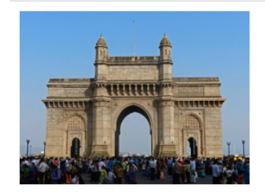
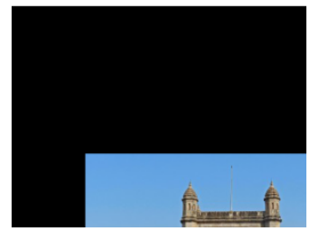
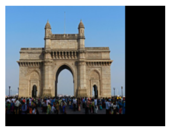
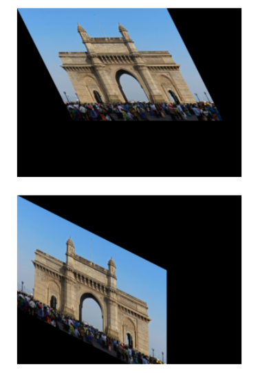
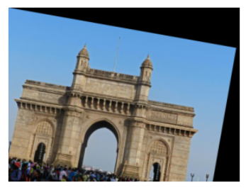

# Image-Transformation
## Aim
To perform image transformation such as Translation, Scaling, Shearing, Reflection, Rotation and Cropping using OpenCV and Python.

## Software Required:
Anaconda - Python 3.7

## Algorithm:
### Step1:
Import the required libraries and read the original image.

### Step2:
Translate the image.

### Step3:
Scale the image.

### Step4:
Shear the image.

### Step5:
Find reflection of image.

### Step 6:
Rotate the image.

### Step 7:
Crop the image.

### Step 8:
Display all the Transformed images.

## Program:
```python
Developed By:S Dhanush Praboo
Register Number:212221230019
import numpy as np
import cv2
import matplotlib.pyplot as plt

input_image=cv2.imread("gate (1).jpg")
input_image=cv2.cvtColor(input_image, cv2.COLOR_BGR2RGB)
plt.axis('off')
plt.imshow(input_image)
plt.show()
i)Image Translation
rows, cols, dim=input_image.shape
M=np.float32([[1, 0, 100],
              [0, 1, 200],
              [0, 0, 1]])
translated_image=cv2.warpPerspective(input_image, M, (cols, rows))

plt.axis('off')
plt.imshow(translated_image)
plt.show()


ii) Image Scaling
rows, cols, dim =input_image.shape
M=np.float32([[1.5, 0,   0],
              [0,   1.8, 0],
              [0,   0,   1]])
scaled_image=cv2.warpPerspective(input_image,M,(cols*2,rows*2))
plt.axis('off')
plt.imshow(scaled_image)
plt.show()

iii)Image shearing
M_x=np.float32([[1, 0.5, 0],
                [0, 1, 0],
                [0, 0, 1]])
M_y=np.float32([[1, 0, 0],
                [0.5, 1, 0],
                [0, 0, 1]])
sheared_image_xaxis= cv2.warpPerspective(input_image,M_x,(int(cols*1.5),int(rows*1.5)))
sheared_image_yaxis= cv2.warpPerspective(input_image,M_y,(int(cols*1.5),int(rows*1.5)))
plt.axis('off')
plt.imshow(sheared_image_xaxis)
plt.show()
plt.axis('off')
plt.imshow(sheared_image_yaxis)
plt.show()


iv)Image Reflection
rows, cols, dim = input_image.shape
M_x=np.float32([[1, 0, 0],
                [0, -1, rows],
                [0, 0, 1]])
M_y=np.float32([[-1, 0, cols],
                [0, 1, 0],
                [0, 0, 1]])
reflected_image_xaxis= cv2.warpPerspective(input_image,M_x,(int(cols),int(rows)))
reflected_image_yaxis= cv2.warpPerspective(input_image,M_y,(int(cols),int(rows)))
plt.axis('off')
plt.imshow(reflected_image_xaxis)
plt.show()
plt.axis('off')
plt.imshow(reflected_image_yaxis)
plt.show()
v)Image Rotation
angle=np.radians(10)
M=np.float32([[np.cos(angle), -(np.sin(angle)), 0],
              [np.sin(angle), np.cos(angle), 0],
              [0, 0, 1]])
rotated_img=cv2.warpPerspective(input_image, M, (int(cols), int(rows)))
plt.axis('off')
plt.imshow(rotated_img)
plt.show()

vi)Image Cropping
cropped_img=input_image[100:300,100:300]
plt.axis("off")
plt.imshow(cropped_img)
plt.show()


```
## Output:

### i)Image Translation


### ii) Image Scaling



### iii)Image shearing


### iv)Image Reflection



### v)Image Rotation


### vi)Image Cropping



## Result: 

Thus the different image transformations such as Translation, Scaling, Shearing, Reflection, Rotation and Cropping are done using OpenCV and python programming.
